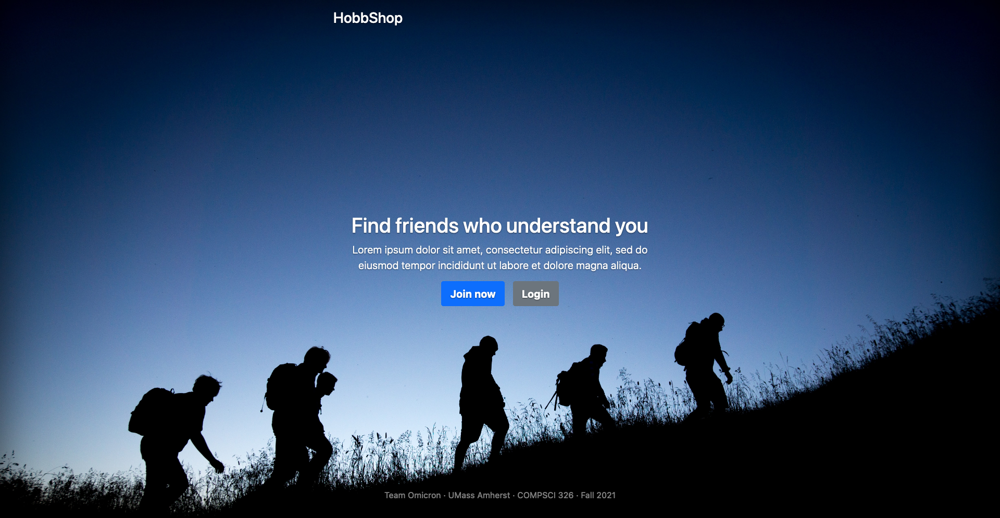

# _HobbShop_

[Github Repo](https://github.com/cs326-f21-omicron/cs326-final-omicron)

# Team Omicron

- Hung Do ([hungmhdo](https://github.com/hungmhdo))
- Luke Nguyen ([lukednguyen](https://github.com/lukednguyen))
- Kirk Smalley ([kjsmalley](https://github.com/kjsmalley))

# Innovative idea

Imagine on a beautiful Saturday morning, you wake up and suddenly decide you want to go fishing down at the pond. You don’t want to go alone, but none of your friends like fishing or aren’t available to go in the morning. To help solve this problem we want to make a web application that allows users to get connected with others who enjoy the same pastimes and have aligning attributes. Our idea is to develop an interface where people can provide their hobbies and recreational habits to a site and then be connected with others who share similar skills and preferences.

The project idea is relatable to several existing social media features. An example is with Facebook’s People Finder in how users can provide information about themselves in order to be matched with the most suitable people taking into account profile characteristics shared by each other repsecitvely. Similarly users have their own profile pages which show friends list and particapting groups as well as recommendations based on their activity and status on the website.

# Important Components

The interface will give users a personal account on the website to view their profile page and see listings for people to connect with. We want the profile page to be able to show the user their personal information, friends list, messages, and inputted location or geographic area. Users can send messages to one another as well as form groups amongst mutual friends where will be captioned or labeled by common qualities of the consisting members. We also want to provide the capability for users to filter friend recommendations by setting parameters for a specific search criteria.

# User Interface

- Landing page

- Signup pages

